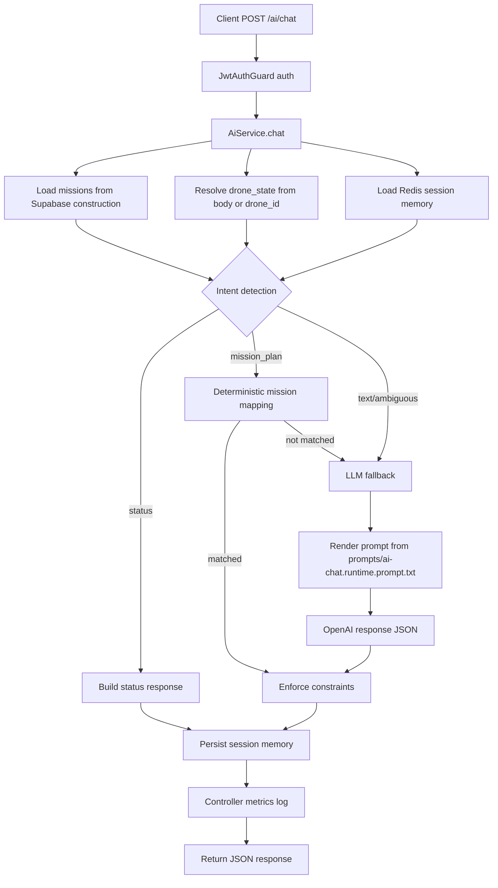

# AI Chat Feature Flow

## Scope

This document describes the backend flow for `POST /ai/chat` in `ArgusBE`.

Key refactor points:
- Prompt template is externalized in `prompts/ai-chat.runtime.prompt.txt`.
- Mission list used for prompt/context is loaded from Supabase deployment `construction`.
- Session memory is persisted via Redis (with in-process fallback if Redis is unavailable).

## Runtime Flow

1. Client calls `POST /ai/chat` with `user_message`, optional `drone_id`, optional `drone_state`.
2. `JwtAuthGuard` validates token and resolves `userId`.
3. `AiService.chat()` resolves context:
   - `available_missions`: pulled from Supabase deployment `construction` (server-side source of truth).
   - `drone_state`: from request body if provided; otherwise loaded via `drone_id` from `arks`.
4. `AiMemoryService` loads last session context (`userId + deploymentId + droneId`) including recent turns.
5. Intent detection runs (`status | mission_plan | text`), including follow-up hints.
6. If deterministic path succeeds:
   - `status`: return filtered drone status.
   - `mission_plan`: map user text to available missions.
7. If deterministic path is insufficient, LLM fallback is used:
   - Prompt is rendered from `prompts/ai-chat.runtime.prompt.txt`.
   - Input placeholders are injected with user message + mission catalog + drone state + recent `chat_history`.
8. Output is validated/enforced:
   - mission IDs must be subset of Supabase mission catalog.
   - status keys must be subset of drone_state keys.
9. Session memory is updated (append user + assistant turns, capped by `AI_MEMORY_TURNS`).
10. Controller logs metrics (`latencyMs`, `responseType`, `missionCount`, `statusKeys`).

## Activity Diagram

## Files Involved

- `src/ai/ai.controller.ts`
- `src/ai/ai.service.ts`
- `src/ai/ai-memory.service.ts`
- `src/ai/prompt-template.service.ts`
- `src/common/redis/redis.service.ts`
- `prompts/ai-chat.runtime.prompt.txt`

## Environment Variables

- `OPENAI_API_KEY`
- `OPENAI_MODEL` (default: `gpt-4.1-mini`)
- `REDIS_URL`
- `AI_MEMORY_TTL_SECONDS`
- `AI_MEMORY_TURNS`
