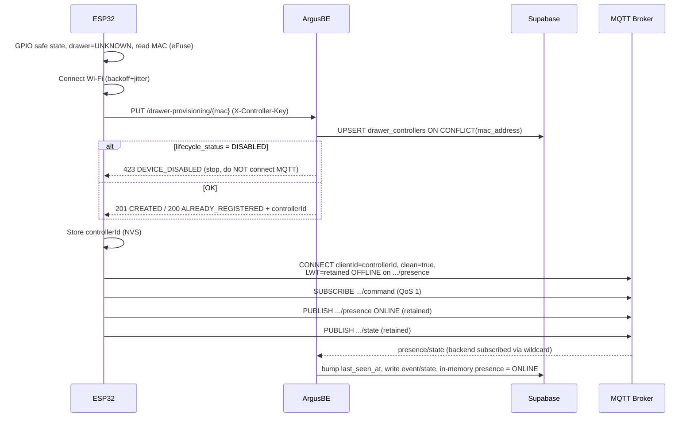
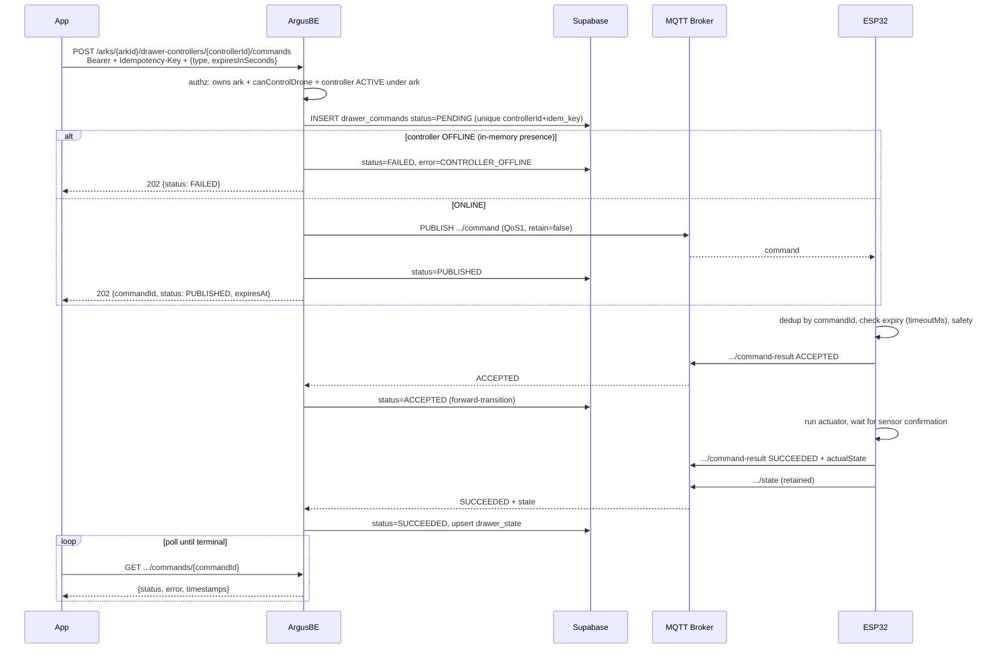

# MQTT ↔ ESP32 (Drawer Controller) — Integration Guide

> **Implementation reference** (mirrors the actual code). The full design and
> rationale live in [ESP32_DEVICE_MVP_PLAN.md](ESP32_DEVICE_MVP_PLAN.md). This
> file focuses on the **flows, HTTP APIs, and MQTT topics** that the ESP32 (or
> simulator) and the App need to call.
>
> **Terminology:** "device" in this repo = **drone**. The ESP32 board that drives
> the drawer is the **`drawer_controller`** (`controllerId`). Do not reuse "device"
> for the ESP32.

---

## 1. Architecture overview

```text
  Mobile App ──HTTPS──►  ArgusBE (NestJS)  ──MQTT──►  MQTT Broker  ──►  ESP32
     ▲                     │  ▲                                          │
     │  poll status        │  └──────────── MQTT (device output) ◄───────┘
     └─────────────────────┘
                           └── Supabase (controllers, commands, state, events)
```

Principles:

- **The App only talks HTTP to ArgusBE.** It does **not** connect to MQTT
  directly; to learn a command result it **polls** `GET .../commands/:commandId`.
- **The ESP32 uses HTTP to register** (to obtain its `controllerId`), then uses
  **MQTT** for command / state / presence / event.
- **The backend is a singleton MQTT client**: it publishes `command`, subscribes
  to every device output topic (wildcard), and persists everything to Supabase.
- **PUBACK ≠ success.** A command is only `SUCCEEDED` when the ESP32 sends a
  `command-result` confirming the real state.

Related backend components:

| Module | File | Role |
| --- | --- | --- |
| Provisioning | [src/drawer-controllers/drawer-provisioning.controller.ts](../src/drawer-controllers/drawer-provisioning.controller.ts) | `PUT /drawer-provisioning/:mac` for the ESP32 |
| Admin controllers | [src/drawer-controllers/drawer-controllers.controller.ts](../src/drawer-controllers/drawer-controllers.controller.ts) | list / assign / enable-disable |
| Commands (App) | [src/drawer-commands/drawer-commands.controller.ts](../src/drawer-commands/drawer-commands.controller.ts) | POST/GET command |
| Reconciler | [src/drawer-commands/drawer-commands.reconciler.ts](../src/drawer-commands/drawer-commands.reconciler.ts) | expire overdue commands |
| MQTT client | [src/mqtt/mqtt.service.ts](../src/mqtt/mqtt.service.ts) | connect/publish/subscribe, in-memory presence |
| MQTT sink | [src/mqtt/mqtt-message-handler.service.ts](../src/mqtt/mqtt-message-handler.service.ts) | persist messages to Supabase |
| Topic/payload | [src/mqtt/mqtt-topics.ts](../src/mqtt/mqtt-topics.ts), [src/mqtt/mqtt-payloads.ts](../src/mqtt/mqtt-payloads.ts) | topic + shape contract |

> **Base URL in examples:** `http://localhost:3333` (`PORT=3333` in
> `.env.example`; there is no global prefix — routes are at the root). Production
> uses HTTPS + `mqtts://`.

---

## 2. Identity (ids)

```text
mac_address   = ESP32 MAC, normalized: UPPERCASE, strip ':' '-' ' ', exactly ^[0-9A-F]{12}$
controllerId  = UUID generated by the backend (drawer_controllers primary key). Stable id.
mqttClientId  = controllerId  (the ESP32 uses controllerId as its MQTT clientId)
commandId     = a command's UUID (drawer_commands.id)
```

The MAC is **not** the primary key. The ESP32 registers by MAC → receives a
`controllerId`, then every MQTT topic is keyed by `controllerId`.

---

## 3. End-to-end flows

### 3.1 ESP32 boot → registration → MQTT



Mandatory on the ESP32 side:

- Call registration **on every boot** (idempotent — the same MAC always yields the
  same `controllerId`).
- `cleanSession = TRUE` so the broker does **not** queue old commands to redeliver
  after reconnect.
- The LWT is a **retained** `presence` message with `{"status":"OFFLINE"}`.
- After connect: subscribe `command` → publish `presence ONLINE` → publish `state`.

### 3.2 App sends command → ESP32 executes → App polls the result



Special branches:

- **Controller OFFLINE at send time** → the command is `FAILED(CONTROLLER_OFFLINE)`
  **immediately**; it does not rely on broker queueing.
- **Publish error** (broker connection lost) → `FAILED(PUBLISH_FAILED)`.
- **ESP32 rejects** (expired/unsupported/unsafe) → `command-result` `REJECTED`.
- **Lost command-result / backend restart** → the reconciler marks it `EXPIRED`
  once past `expires_at` (see §7).
- **Double POST with the same `Idempotency-Key`** → returns the **existing
  command**, no new record, no re-publish.

---

## 4. HTTP API

### 4.1 ESP32 — Registration

```http
PUT /drawer-provisioning/:mac
X-Controller-Key: <CONTROLLER_API_KEY>
Content-Type: application/json
```

`:mac` may be in any format (`7C:DF:A1:12:34:56`, `7c-df-a1-12-34-56`, …); the
backend normalizes it before processing.

Body (all optional except `controllerType`):

```json
{
  "serialNumber": "ARGUS-ESP32-001",
  "controllerType": "DRAWER_CONTROLLER",
  "hardware": { "chipModel": "ESP32-S3", "chipRevision": 1, "cores": 2, "flashSize": 8388608 },
  "firmware": { "version": "0.1.0", "build": "2026-07-14" },
  "capabilities": ["DRAWER_OPEN", "DRAWER_CLOSE", "LIGHT_ON", "LIGHT_OFF"],
  "network": { "ipAddress": "192.168.1.23", "wifiRssi": -61 },
  "boot": { "bootId": "random-per-boot", "resetReason": "POWER_ON" }
}
```

> Do **NOT** send the Wi-Fi/MQTT password in the body.

Response — `201` (newly created) or `200` (already exists):

```json
{
  "controllerId": "6f1604cd-84d6-4ac4-9134-d5d03a4c2ad3",
  "macAddress": "7CDFA1123456",
  "registrationOutcome": "CREATED",
  "lifecycleStatus": "UNASSIGNED",
  "serverTime": "2026-07-14T10:00:00Z"
}
```

- `registrationOutcome`: `CREATED` (201) | `ALREADY_REGISTERED` (200).
- `lifecycleStatus`: `UNASSIGNED` | `ACTIVE` | `DISABLED` (lifecycle — distinct from
  the outcome). `ark_id` and `lifecycle_status` are **not** overwritten on
  re-registration (they survive reboots).

Errors (shape `{ "message": string, "code": string }`):

| HTTP | Code | Meaning |
| --- | --- | --- |
| 400 | `INVALID_MAC` | MAC is not 12-hex after normalization |
| 401 | `INVALID_CONTROLLER_KEY` | Wrong `X-Controller-Key` / server key not configured |
| 423 | `DEVICE_DISABLED` | Controller has been disabled by an admin (no "revive") |
| 500 | `REGISTRATION_FAILED` | DB error |

### 4.2 App — Send command

```http
POST /arks/:arkId/drawer-controllers/:controllerId/commands
Authorization: Bearer <user JWT>
Idempotency-Key: <unique, required>
Content-Type: application/json
```

```json
{ "type": "DRAWER_OPEN", "expiresInSeconds": 15 }
```

- `type` ∈ `DRAWER_OPEN` | `DRAWER_CLOSE` | `LIGHT_ON` | `LIGHT_OFF`.
- `expiresInSeconds` optional, `@IsInt @Min(5) @Max(60)`, default **15**.
- **Authorization (all three required):** the user owns the ark; the role has
  `canControlDrone` (OPERATOR/ADMIN — GUEST is blocked); the controller belongs to
  `arkId` and `lifecycle_status = ACTIVE`.

Response `202 Accepted`:

```json
{
  "commandId": "b66fbab7-…",
  "controllerId": "6f1604cd-…",
  "arkId": "ark-01",
  "type": "DRAWER_OPEN",
  "status": "PUBLISHED",
  "errorCode": null,
  "errorMessage": null,
  "createdAt": "2026-07-14T10:00:00Z",
  "publishedAt": "2026-07-14T10:00:00Z",
  "acceptedAt": null,
  "completedAt": null,
  "expiresAt": "2026-07-14T10:00:15Z"
}
```

At the time it returns, `status` may be `PUBLISHED`, or `FAILED` (if offline /
publish error), or the existing command (if the `Idempotency-Key` is a duplicate).

Common errors:

| HTTP | Code | When |
| --- | --- | --- |
| 400 | `MISSING_IDEMPOTENCY_KEY` | missing `Idempotency-Key` header |
| 400 | `INVALID_COMMAND_TYPE` | invalid `type` |
| 403 | `FORBIDDEN` | role lacks `canControlDrone` |
| 404 | `ARK_NOT_FOUND` | ark does not exist / not owned by the user |
| 404 | `CONTROLLER_NOT_FOUND` | controller does not belong to the ark |
| 409 | `DRAWER_NOT_ACTIVE` | controller is not `ACTIVE` yet |

### 4.3 App — Poll command status

```http
GET /arks/:arkId/drawer-controllers/:controllerId/commands/:commandId
Authorization: Bearer <user JWT>
```

Returns the same shape as the POST response (with `status`,
`errorCode/errorMessage`, `acceptedAt`, `completedAt`, …). The App polls until
`status` is terminal: `SUCCEEDED` | `FAILED` | `REJECTED` | `EXPIRED`.

### 4.4 Admin — Manage controllers

All require `Authorization: Bearer <ADMIN JWT>` (role `ADMIN`).

```http
GET   /drawer-controllers                 # list all controllers
PATCH /drawer-controllers/:id/assign      # body { "arkId": "ark-01" } → assign ark + ACTIVE
PATCH /drawer-controllers/:id/status      # body { "lifecycleStatus": "DISABLED" }
```

- `assign` moves `UNASSIGNED → ACTIVE` and sets `ark_id` (required before the App
  can send commands; a freshly registered controller is `UNASSIGNED`).
- `status` sets `UNASSIGNED` | `ACTIVE` | `DISABLED`.

---

## 5. MQTT — Topics & contract

### 5.1 Topic tree

```text
argus/v1/controllers/{controllerId}/command          ← backend PUBLISH, ESP32 SUBSCRIBE
argus/v1/controllers/{controllerId}/command-result   → ESP32 PUBLISH, backend SUBSCRIBE
argus/v1/controllers/{controllerId}/state            → ESP32 PUBLISH (retained)
argus/v1/controllers/{controllerId}/presence         → ESP32 PUBLISH (retained + LWT)
argus/v1/controllers/{controllerId}/event            → ESP32 PUBLISH
```

The backend subscribes with a **wildcard** for the 4 device output leaves:

```text
argus/v1/controllers/+/command-result
argus/v1/controllers/+/state
argus/v1/controllers/+/presence
argus/v1/controllers/+/event
```

### 5.2 QoS & retained

| Message | Direction | QoS | Retained |
| --- | --- | ---: | --- |
| `command` | BE → ESP32 | 1 | **No** |
| `command-result` | ESP32 → BE | 1 | No |
| `state` | ESP32 → BE | 1 | **Yes** |
| `presence` | ESP32 → BE | 1 | **Yes** (and is the LWT) |
| `event` | ESP32 → BE | 1 | No |

- `command` is **not retained** + ESP32 `cleanSession=TRUE` → it never runs an old
  command after reboot/reconnect.
- QoS 1 ⇒ can **duplicate**. The ESP32 dedups by `commandId`; the backend is
  idempotent via forward-transition (see §6.3).

### 5.3 Payloads (every payload carries `schemaVersion: 1`)

**`command`** (BE → ESP32):

```json
{
  "schemaVersion": 1,
  "commandId": "b66fbab7-…",
  "type": "DRAWER_OPEN",
  "issuedAt": "2026-07-14T10:00:00Z",
  "expiresAt": "2026-07-14T10:00:15Z",
  "parameters": { "timeoutMs": 8000 }
}
```

`parameters.timeoutMs` by type: `DRAWER_OPEN`/`DRAWER_CLOSE` = **8000**,
`LIGHT_ON`/`LIGHT_OFF` = **2000**. The ESP32 should use the **relative** `timeoutMs`
(measured from receipt) to reject/expire — safe when not yet NTP-synced; only use
the absolute `expiresAt` once NTP-synced.

**`command-result`** (ESP32 → BE):

```json
{
  "schemaVersion": 1,
  "commandId": "b66fbab7-…",
  "status": "SUCCEEDED",
  "actualState": { "drawer": "OPEN", "light": "ON" },
  "errorCode": null,
  "errorMessage": null,
  "completedAt": "2026-07-14T10:00:03Z"
}
```

`status` ∈ `ACCEPTED` | `SUCCEEDED` | `FAILED` | `REJECTED`. Send `SUCCEEDED` only
after the ESP32 has **confirmed the real state** (sensor-preferred), not when the
relay was merely switched on.

**`state`** (ESP32 → BE, retained):

```json
{
  "schemaVersion": 1,
  "drawerState": "OPEN",
  "lightState": "ON",
  "lockState": "UNLOCKED",
  "sensorState": { "limitOpen": true },
  "bootId": "…",
  "timestamp": "2026-07-14T10:00:03Z"
}
```

`drawerState` ∈ `UNKNOWN` | `CLOSED` | `OPENING` | `OPEN` | `CLOSING` | `BLOCKED` |
`FAULT`. The backend **upserts** one `drawer_state` row per controller (latest wins).

**`presence`** (ESP32 → BE, retained; also the LWT):

```json
{ "schemaVersion": 1, "status": "ONLINE", "bootId": "…", "firmwareVersion": "0.1.0", "timestamp": "…" }
```

LWT (the broker publishes it when the ESP32 drops abruptly) — retained:

```json
{ "schemaVersion": 1, "status": "OFFLINE" }
```

**`event`** (ESP32 → BE):

```json
{ "schemaVersion": 1, "eventType": "drawer_move_timeout", "severity": "ERROR", "payload": {}, "timestamp": "…" }
```

`severity` ∈ `INFO` | `WARNING` | `ERROR` | `CRITICAL` (default `INFO`).

---

## 6. How the backend handles messages (sink)

All in [mqtt-message-handler.service.ts](../src/mqtt/mqtt-message-handler.service.ts).
Malformed JSON → **logged & ignored, never crashes**.

### 6.1 Shared step

For every message: `touchController(controllerId)` → bump `last_seen_at`. If the
`controllerId` does not exist (including a non-UUID) → **ignored**.

### 6.2 By leaf

| Leaf | DB action |
| --- | --- |
| `presence` | INSERT `drawer_events` (`event_type='presence'`, payload `{status, bootId}`) |
| `state` | UPSERT `drawer_state` by `drawer_controller_id` (latest state) |
| `command-result` | UPDATE `drawer_commands` (forward-transition, see §6.3) |
| `event` | INSERT `drawer_events` |

### 6.3 Forward-transition for command-result

The update only applies when the command belongs to the right controller **and** is
in a valid source state:

```text
ACCEPTED   ← only from {PENDING, PUBLISHED}
SUCCEEDED  ← only from {PENDING, PUBLISHED, ACCEPTED}
FAILED     ← only from {PENDING, PUBLISHED, ACCEPTED}
REJECTED   ← only from {PENDING, PUBLISHED, ACCEPTED}
```

A late/duplicate result (QoS 1) matches **0 rows** → ignored, **state is not rolled
back**. This is the backend's dedup mechanism.

### 6.4 Presence & liveness (in-memory)

- [mqtt.service.ts](../src/mqtt/mqtt.service.ts) keeps an in-memory map
  `controllerId → { online, lastSeen }`.
- **Only the `presence` leaf** flips the `online` flag (retained state/event
  redelivered after a restart must **not** be treated as a false "online").
- `isControllerOnline` = has an `ONLINE` presence **and** `lastSeen` within
  `DRAWER_HEARTBEAT_TIMEOUT_SECONDS`. This is the basis for command fail-fast when
  offline.
- The map repopulates after a restart from the **retained** presence/state on the broker.

---

## 7. Command state machine & reconciler

```text
PENDING ──► PUBLISHED ──► ACCEPTED ──► SUCCEEDED
   │            │            │
   │            │            ├──► FAILED
   │            │            └──► REJECTED
   │            │
   ├─(offline)─►│                     FAILED (CONTROLLER_OFFLINE)   ← at create time
   ├─(pub err)─►│                     FAILED (PUBLISH_FAILED)       ← at publish time
   └────────────┴──────────────────►  EXPIRED (TIMEOUT)            ← reconciler
```

- The **reconciler** ([drawer-commands.reconciler.ts](../src/drawer-commands/drawer-commands.reconciler.ts))
  runs a `setInterval` every `COMMAND_RECONCILE_INTERVAL_MS`: any command with
  `status ∈ {PENDING, PUBLISHED, ACCEPTED}` and `expires_at < now()` becomes
  `EXPIRED` (`error_code=TIMEOUT`). This is the safety net for lost command-results
  and for a backend restart mid-flight — a command **never hangs forever**.

---

## 8. Configuration & environment

`.env` (see [.env.example](../.env.example) §Drawer controllers):

```env
CONTROLLER_API_KEY=prototype-shared-controller-key   # X-Controller-Key the ESP32 sends
MQTT_URL=mqtt://localhost:1883                        # scheme required (mqtt:// | mqtts:// | ws:// | wss://)
MQTT_BACKEND_CLIENT_ID=argus-backend
MQTT_USERNAME=
MQTT_PASSWORD=
MQTT_COMMAND_TIMEOUT_MS=15000
DRAWER_HEARTBEAT_TIMEOUT_SECONDS=90                   # no traffic for this long ⇒ treated as offline
COMMAND_RECONCILE_INTERVAL_MS=10000
```

Notes:

- `MQTT_URL` **without a scheme** → MQTT is disabled, and every command returns
  `FAILED(CONTROLLER_OFFLINE)` (the app does not crash).
- An empty `CONTROLLER_API_KEY` → the guard **fails closed**: every registration is `401`.
- Production: switch to `mqtts://` + HTTPS, per-controller credentials/ACLs (see the
  risk table in PLAN §18).

---

## 9. Running & testing locally (without real ESP32)

```bash
# 1. Start the MQTT broker (Mosquitto, anonymous — DEV ONLY)
docker compose -f docker-compose.mqtt.yml up -d

# 2. Run the backend (needs CONTROLLER_API_KEY + MQTT_URL in .env.development)
npm run start:dev

# 3. Run the ESP32 simulator (uses the same registration + MQTT contract)
node tools/drawer-simulator/simulator.mjs
```

Then assign the controller to an ark and send a command:

```bash
# Find the controllerId
curl -H "Authorization: Bearer <ADMIN_JWT>" http://localhost:3333/drawer-controllers

# Assign + activate it under an ark you own
curl -X PATCH -H "Authorization: Bearer <ADMIN_JWT>" -H "Content-Type: application/json" \
  -d '{"arkId":"ark-01"}' \
  http://localhost:3333/drawer-controllers/<controllerId>/assign

# Send a command (OPERATOR/ADMIN, owns the ark)
curl -X POST -H "Authorization: Bearer <JWT>" -H "Content-Type: application/json" \
  -H "Idempotency-Key: $(uuidgen)" \
  -d '{"type":"DRAWER_OPEN","expiresInSeconds":15}' \
  http://localhost:3333/arks/ark-01/drawer-controllers/<controllerId>/commands

# Poll the status
curl -H "Authorization: Bearer <JWT>" \
  http://localhost:3333/arks/ark-01/drawer-controllers/<controllerId>/commands/<commandId>
```

The simulator supports `FAIL_MODE` to test the branches: `none` (default,
SUCCEEDED), `fail` (FAILED + event), `timeout` (no result → reconciler EXPIREs),
`duplicate` (SUCCEEDED twice → tests dedup). Details:
[tools/drawer-simulator/README.md](../tools/drawer-simulator/README.md).

Swagger UI: `http://localhost:3333/docs` — tag groups `drawer-provisioning`,
`drawer-controllers`, `drawer-commands`.

---

## 10. Integration checklist for the ESP32 firmware

- [ ] Read the base MAC (eFuse); no need to normalize (the backend does it).
- [ ] `PUT /drawer-provisioning/{mac}` on every boot with `X-Controller-Key`; store
      `controllerId` in NVS.
- [ ] On `423` → stop, show error LED, do **not** connect MQTT. Network/5xx →
      backoff+jitter.
- [ ] MQTT connect: `clientId = controllerId`, `cleanSession = true`, LWT = retained
      `OFFLINE` on `.../presence`.
- [ ] After connect: subscribe `.../command` (QoS1) → publish `presence ONLINE`
      (retained) → publish `state` (retained).
- [ ] On `command`: reject if `schemaVersion` unsupported / missing `commandId` /
      expired (by local `timeoutMs`) / unsupported type / unsafe state.
- [ ] **Dedup by `commandId`** — never fire the actuator twice for the same command.
- [ ] Publish `command-result` `ACCEPTED` → (run) → `SUCCEEDED`/`FAILED`/`REJECTED`;
      include `actualState` on success. Only `SUCCEEDED` after the sensor confirms.
- [ ] Publish `state` (retained) after each change; publish `event` on a fault.
- [ ] Reconnect: backoff+jitter → resubscribe `command` → publish `ONLINE` + `state`.
- [ ] Never log `WIFI_PASSWORD`, `CONTROLLER_API_KEY`, `MQTT_PASSWORD`.

---

## 11. Related

- Full design, DB schema, phases, test cases, risks:
  [ESP32_DEVICE_MVP_PLAN.md](ESP32_DEVICE_MVP_PLAN.md).
- Schema migration: [migrations/20260714_drawer_controllers_mvp.sql](../migrations/20260714_drawer_controllers_mvp.sql).
- Simulator: [tools/drawer-simulator/README.md](../tools/drawer-simulator/README.md).
- Local broker: [docker-compose.mqtt.yml](../docker-compose.mqtt.yml),
  [infra/mosquitto/mosquitto.conf](../infra/mosquitto/mosquitto.conf).
</content>
